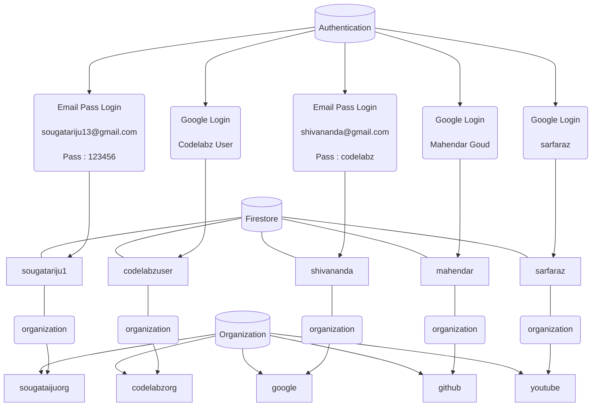

# Table of Content
1. [CodeLabz](#codelabz)
2. [Deployed on](#deployed-on)
3. [Community](#community)
4. [User Guide](#user-guide)
    1. [How to Setup](#how-to-setup)
    2. [How to Use](#how-to-use)
5. [Set-up-Firebase](#set-up-firebase)
    1. [How to Deploy Firebase Cloud Functions](#how-to-deploy-firebase-cloud-functions)
6. [Firebase Emulator Flow](#firebase-emulator-flow)
7. [Install, Configure and Integrate Firebase Emulator Suite](#install-configure-and-integrate-firebase-emulator-suite)
   1. [<strong>How to install</strong>](#how-to-install)
   2. [<strong>How to Configure</strong>](#how-to-configure)
8. [Integrate With your CI System.](#integrate-with-your-ci-system)
    1. [To Start the Emulators:-](#to-start-the-emulators-)
    2. [Import and Export:-](#import-and-export-)
9. [FAQs(Frequently Asked Questions)](#faqs)    
    1. Login/Signup is not working.
# CodeLabz

CodeLabz is a platform where the users can engage with online tutorials and the organizations can create tutorials for the users. The platform will be developed using ReactJS frontend library and the backend will be developed using the Google Cloud Firestore and Google Firebase Real-Time database.

# Deployed on

https://dev.codelabz.io/

# Community 

Join and communicate with other members on our community. We communicate on gitter

[](https://gitter.im/scorelab/CodeLabz?utm_source=badge&utm_medium=badge&utm_campaign=pr-badge)

## User Guide

#### How to Setup

Clone the repository.

For cloning this repo: Run `git clone https://github.com/scorelab/Codelabz.git`.

Run the above command in the folder in which you want to make a clone.

#### How to Use

Run `npm install` in `CodeLabz` folder.

```
 cd CodeLabz/
 npm install
```
> **NOTE**: If `npm install` is not executing successfully, then use node v14 and `npm install --legacy-peer-deps` and try again.

First you need to create a `.env` file in `CodeLabz` folder following the template provided in the file `.env.sample`.<br/> <br/>

## Set-up-Firebase
1. Sign in to https://console.firebase.google.com/.
2. Click **Add Project** and necessary information about the project.(Below mentioned the Steps to add project to firebase) 
    - To add Firebase resources to an existing Google Cloud project, enter its project name or select it from the dropdown menu.
    - To create a new project, enter the desired project name. You can also optionally edit the project ID displayed below the project name
    - Firebase generates a unique ID for your Firebase project based upon the name you give it. If you want to edit this project ID, you must do it now as it cannot be       altered after Firebase provisions resources for your project. Visit Understand Firebase Projects to learn about how Firebase uses the project ID.
3. Agree to the terms and click **Create Project**.
4. After creating the project, click **Add Firebase to your web app**.
    - In the center of the Firebase console's project overview page, click the Web icon  to launch the setup workflow.
    - If you've already added an app to your Firebase project, click Add app to display the platform options.
    - Enter your app's nickname.
    - This nickname is an internal, convenience identifier and is only visible to you in the Firebase console.
    - Click Register app.
5. Copy the firebase configuration.
6. Paste the configuration `.env` file.
7. You can find your **<FIREBASE_DATABASE_URL>** in the Realtime Database section of the Firebase console. Depending on the location of the database, the database URL  will be in one of the following forms:
    - https://DATABASE_NAME.firebaseio.com (for databases in us-central1)
    - https://DATABASE_NAME.REGION.firebasedatabase.app (for databases in all other locations)
8. You can get your <FIREBASE_VAPID_KEY> from Cloud-Messaging tab
    - navigate to the setting of your project Open the Cloud Messaging tab.
    - scroll to the Web configuration section.
    - In the Web Push certificates tab, click Generate Key Pair. The console displays a notice that the key pair was generated. You get your Vapid key form there.

You should fill in these values in their relevent fields in the `.env` file.

To run the project:  
 `$ npm start`

If you failed to run the project do the following steps :

- delete node modules
- delete package-lock.json
- re run `npm install `
  If error still exists add `SKIP_PREFLIGHT_CHECK=true` in your .env file

> **NOTE**: Before starting the server create a file named `.env` same as `.env.sample` and add your **Firebase Configurations** in the file.

Visit [localhost:3000](http://localhost:3000) to browse.

#### How to Deploy Firebase Cloud Functions

> **NOTE**:To Deploy firebase cloud functions you have to satisfy following requirements

1. Your Firebase project should have Blaze plan or higher version
   ##steps to upgrade to blaze plan
   1. Log in to the Firebase Console. In the lower left, you will see that your project is listed on the Spark plan. Click the upgrade button.
   2. Select the Blaze plan
   3. Select a billing account. Then click Continue and Purchase. And there you go on the Blaze plan.
2. You should have installed Firebase CLI tool in your machine
   To install Firebase CLI machine you can use the command **npm install -g firebase-tools**

Run `npm install` in `CodeLabz/functions ` folder.

```
 cd CodeLabz/functions
 npm install
```

Then you have to generate a private key file for your service account.To get the key file go to this link and follow the instructions https://firebase.google.com/docs/admin/setup#initialize-sdk.

Once you have obtained the key, create a folder named as **'private'** in the directory **'CodeLabz/functions'**. Then copy and paste the key file in private folder.
Rename the key file as **'cl-dev-pk.json'**

After that change the database url to your project database url in **'CodeLabz/functions/auth.js'**

Move to the root directory and open a command prompt and type following commands

```
 npm run-script build
 firebase login
 firebase projects:list
```

Find the project ID from the project list that you want to deploy the cloud functions

```
firebase use <project_id>
firebase deploy
```

To run storybook :
` npm run storybook`
It will redirect to 6006 port. Find detailed information [here](https://storybook.js.org/docs/react/get-started/introduction)

To run cypress tests:
`npx cypress run`
It will open a prompt displaying all the tests. You can find detailed information [here](https://docs.cypress.io/guides/guides/command-line#How-to-run-commands)
# Firebase Emulator Flow

# Install, Configure and Integrate Firebase Emulator Suite
## **How to install**
#### Before installing the Emulator Suite you will need:-

- Node.js version 8.0 or higher.

- Java JDK version 11 or higher.

#### To install the Emulator Suite:
- Install the Firebase CLI. If you don't already have the Firebase CLI installed, install it (https://firebase.google.com/docs/cli#install-cli-windows). 
  You will need CLI version 8.14.0 or higher to use the Emulator Suite.
- You can install the Firebase CLI using npm (the Node Package Manager). Note that you will need to install Node.js and npm. Installing Node.js should install npm as well.

```
npm install -g firebase-tools
```
  
- You can check which version you have installed using the following command in the terminal.
  
```
firebase --version
```
    
- After Installation, Initialize the firebase Using
  
```
firebase init
```

-  Now Set up the Emulator Suite. The Below Command Provides you the emultors Like, Authentication,Firestore, Realtime Database,Storage DataBase etc.
   Select the emulators you needed
    
```
firebase init emulators
``` 
## **How to Configure** 

#### Configure Emulator Suite:-

- You can optionally configure the emulators network ports and path to Security Rules definitions in the firebase.json file:
- Change emulator ports by running `firebase init emulators` or by editing `firebase.json` manually.
    
Note:-(***Recommended***)If you don't configure these settings, the emulators will listen on their default ports, and the Cloud Firestore, Realtime Database and Cloud Storage 
        emulators will run with open data security.
#### Port Configuration - These are the Default Ports Provided you can change them while initializing(if needed)

| Emulator             | Ports|
| ---                  | ---  |
| Authentication       | 9099 |
| Emulator Suite UI    | 9099 |
| Cloud Functions      | 9099 |
| Realtime Database    | 9099 |
| Cloud Firestore      | 8080 |
| Cloud Storage        | 8080 |
| Firebase Hosting     | 5000 |
| Pub/Sub              | 8085 |

- The emulators will take Security Rules configuration from the database, firestore and storage configuration keys in `firebase.json`.

## Integrate With your CI System.

- Installation and configuration of the Emulator Suite with containers in a typical CI setup is straightforward.

#### To Start the Emulators:-
- The Emulators can be start according to the user preferences, .Find detailed information [here](https://github.com/scorelab/Codelabz/blob/master/local-firebase-emulators-import-export.md)

```
firebase emulators:start
```
or 
```
npm run emulator
```
- You need to run `firebase emulators:start` or `npm run emulator` first and then run `npm start` inorder to run the codelabz webpage.
- You can check/open Emulator suite by visiting [localhost:4000](http://localhost:4000).
  
#### Import and Export:-
- To import ```npm run emulator-import```
- To export ```npm run emulator-export```
- Note:- To understand beforehand about importing data from and to emulators, please see [this](https://github.com/scorelab/Codelabz/blob/master/local-firebase-emulators-import-export.md).
- **READ THE [RULE-SET](https://github.com/scorelab/Codelabz/blob/master/rule_sets.md) FILE PRIOR TO USING "testdata" FILE.**

# FAQs
### 1. Login/Signup is not working ?


### Solution :-
This problem generally arises when you have not setuped/started the Firebase emulators.

1. [Setup firebase emulator](#how-to-install). 
2. [Start the Emulators](#to-start-the-emulators-)
3. Run the app using `npm start`.

>**NOTE** : Remember to start the emulators before running the app. 

- To start emulators - `firebase emulators:start --import=firebase.json --project <your-project-id>`. <br/>
- In some case all the emulator will not start. So you can execute a separate command for a particular emulator<br/>
  For example if auth emulator is not starting you can use this command - <br/> `firebase emulators:start --import=firebase.json --project <your-project-id> --only auth`.
