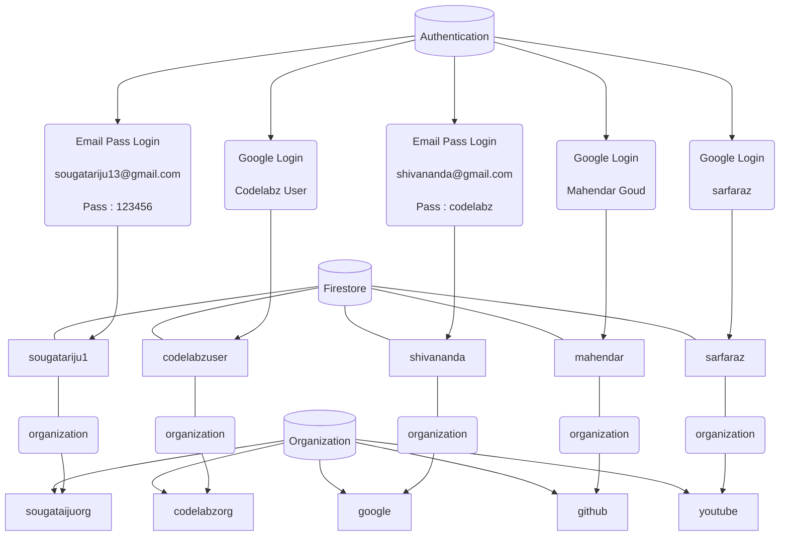

# TESTDATA

Located at `./testdata`.

```mermaid
flowchart TB
     sougatarmail("Email Pass Login \n \n sougatariju13@gmail.com \n\n Pass : 123456 ")
    codelabzusermail("Google Login \n \n Codelabz User")
    shivanandamail("Email Pass Login \n \n shivananda@gmail.com \n\n Pass : codelabz ")
    mahendarmail("Google Login \n \n Mahendar Goud")
    sarfarazmail("Google Login \n \n sarfaraz")

    org[(Organization)]-->sougataijuorg
    org[(Organization)]-->codelabzorg
    org[(Organization)]-->google
    org[(Organization)]-->github
    org[(Organization)]-->youtube

    ft[(Firestore)]---sougatariju1---id1(organization)-->sougataijuorg
    ft[(Firestore)]---codelabzuser---id2(organization)-->codelabzorg
    ft[(Firestore)]---shivananda---id3(organization)-->google
    ft[(Firestore)]---mahendar---id4(organization)-->github
    ft[(Firestore)]---sarfaraz---id5(organization)-->youtube

    auth[(Authentication)]--->sougatarmail--->sougatariju1
    auth[(Authentication)]--->codelabzusermail--->codelabzuser
    auth[(Authentication)]--->shivanandamail--->shivananda
    auth[(Authentication)]--->mahendarmail--->mahendar
    auth[(Authentication)]--->sarfarazmail--->sarfaraz
```
